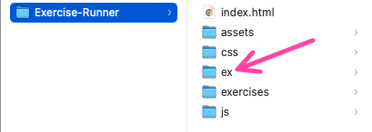
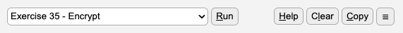
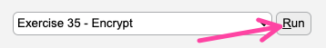
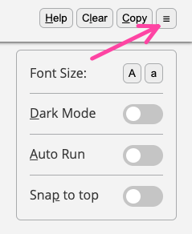

# Exercise Runner - User Manual

## What is the Exercise Runner

Exercise Runner was designed by Coding Academy as an environment for displaying and running the 60 basic JavaScript exercises. It is simple to use, offers a few conveniences, and lets our students focus on writing their code for the exercise solutions, without having to take care of wiring up the code to an HTML environment.

The output of all 60 exercises is limited to the browser’s console, and the runner’s user interface was designed to work with the dev tools open, and occupying much of the screen’s real estate.

## Opening and launching the runner

For the runner to work properly, it’s enclosing folder, simply named **Exercise-Runner**, has to be opened in vscode. This can be done in several ways -

- Drag the Exercise-Runner folder into vscode.
- From vscode’s file menu, choose open folder, navigate to the Exercise-Runner folder and open it
- An **Open in Vscode** option should be available if you right click the Exercise-Runner folder. This option is available in Windows PCs only, and only if this option was enabled during the vscode installation.

<aside>
⚠️ Opening the runner from a wrong folder will cause it to malfunction.

</aside>

Once the runner has been opened from the correct folder in vscode, right click the ***index.html*** file inside it and select **Open with Live Server** from the menu. This will launch the exercise runner in a new browser tab. 

If you do not see the **Open with Live Server** option in the menu - you probably need to install the live server extension inside vscode.

## Loading and running exercise scripts

The solution scripts for all exercises should be saved to the **ex** folder which is found inside the main **Exercise-Runner** folder (see the screenshot bellow). 

Folder structure

Each exercise script should  be saved in a separate ***.js*** file named by the exercise’s number. 

For example, the exercise script for exercise 1, will be saved in a file named ***01.js*** inside the **ex** folder. Please note that all file names must consist of two digits, so exercises 1 - 9 will need to have leading zeros in their file names. This is essential for the runner to properly locate and load the exercise scripts.

## Working with the runner

The runner’s two main functions are displaying the exercises and running the exercise scripts. Both of these functions and a few others can be accessed from the toolbar.

### The toolbar

The toolbar is the main user interface element of the exercise runner. The table bellow summarizes Its controls and their function (from left to right).

| Control | Function |
| --- | --- |
| Exercise selector | Selects an exercise and displays it |
| Run | Loads The selected exercise’s script and executes it. |
| Help | Displays a list of shortcut keys |
| Clear | Clears the console |
| Copy | Copies the selected exercise’s text to the clipboard |
| ☰ | Toggle display of the settings panel |

### Running the selected exercise

To run an exercise script, first navigating to that exercise by using the **exercise selector** or any of the navigation methods described in the [next section](#navigation), and then use the **Run** button to load and execute that script.

## Navigation

There are several ways to navigate between the different exercises.

### The exercise selector

Click anywhere in the exercise selector dropdown to reveal a list of all exercises. Select an exercise to scroll it into view.

The exercise selector dropdown

### Typing the exercise number

Type the exercise number you wish to navigate to. The digits will appear in the top right corner of the runner as you type them and the runner will scroll to the appropriate exercise once you finish typing. Valid exercise numbers are between 1 and 60. Invalid numbers will be ignored.

Please note that the browser window displaying the runner, needs to be in focus for this to work. Often, the focus will be on the dev tools panel which will simply show your typing in the console prompt. To move focus to the runner simply click anywhere inside it. 

### Using the arrow keys

The up and down arrow keys can be used to scroll one exercise forwards or backwards.

### Scrolling

Scrolling freely through the exercises will set the selected exercise as it enters the viewport. If the ***[Snap to top](#snap-to-top)*** option is enabled, then the exercise heading will automatically snap to the top of the viewport, regardless of how far down it has been scrolled.

## Features

### Copy as comment

Copies the currently selected exercise to the clipboard as a multi line comment. This is intended for pasting into the top of the exercise script file to provide a quick reference during coding. Multi line comments can also be collapsed or folded up in vscode in case you need to get them out of sight for a while.

### Clear console

Clears all previous output from the console.

## Settings

Access the settings panel from the hamburger menu at the right end of the toolbar. 

The settings panel

The following settings can be controlled through this panel:

### Font size

Font size can be increased or decreased to your convenience.

### Dark mode

Toggle dark mode. This can reduce strain on your eyes.

### Auto run

When switched on, each time an exercise script is saved it will be automatically executed. This might be undesirable in some cases, especially with exercises which contain prompts and alerts.

### Snap to top

When switched on, exercises which you scroll into, will be snapped to the top of the viewport. This might work well for short exercises taking up less than a full screen, but tends to become inconvenient with the longer ones which span across more than one full screen.

## Shortcut keys

All features and settings can be controlled through shortcut keys. These are summarized in the table bellow and can be displayed inside the Exercise Runner by clicking the **Help** key.

| Feature / Setting | Shortcut key |
| --- | --- |
| Display a list of shortcut keys | h |
| Run the currently selected exercise | r |
| Copy the selected exercise as a multiline comment | c |
| Clear the console | l |
| Toggle dark mode | d |
| Toggle autorun | a |
| Toggle snap to top | p |
| Open / Close the settings panel | s |
| Increase / Decrease font size | + / - |